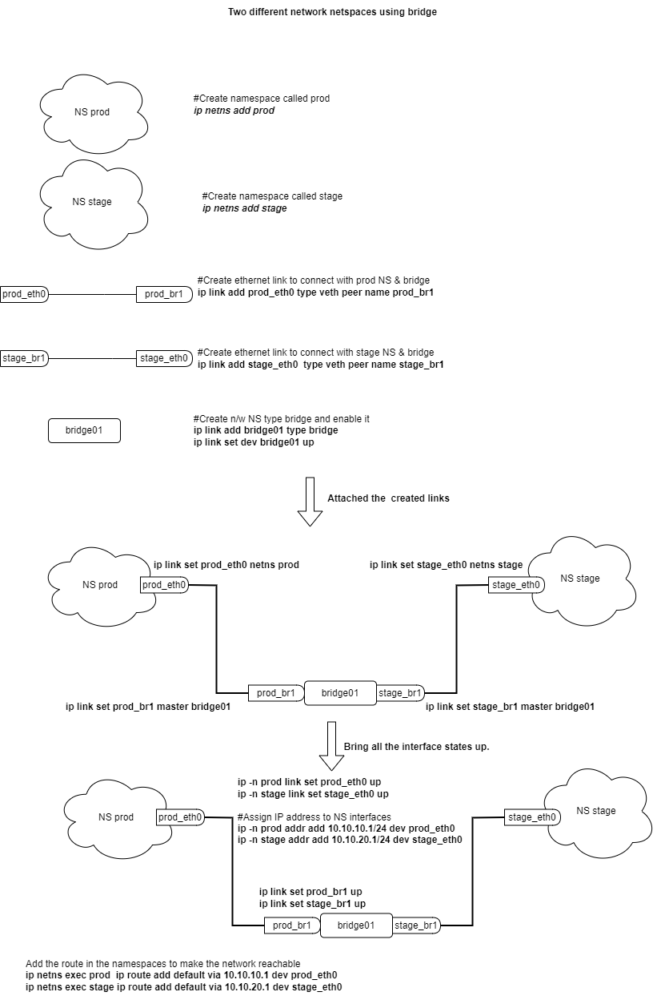

# Network NameSpace Basics Demonstration:
## Option 1

### Option 1a: Enable reachability when the namespaces are part of different network subnets.

# Option 2: A bridge to connect different network namespaces

